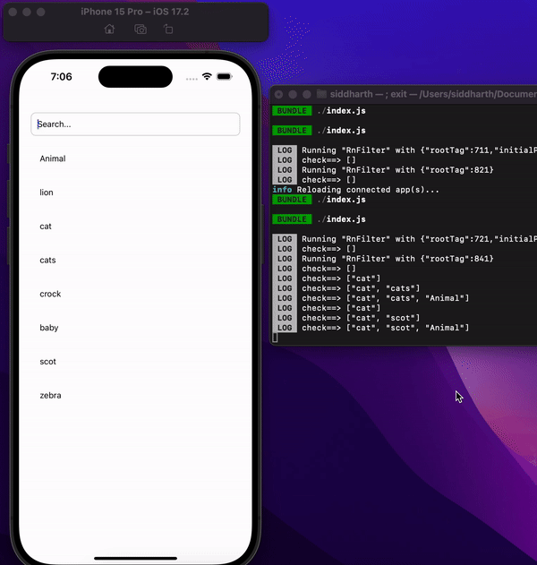
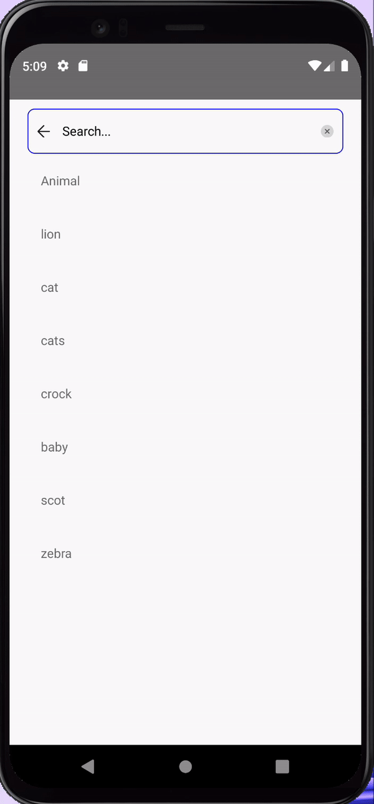

# rn-filter-bar

| iOS                            | Android                                |
| ------------------------------ | -------------------------------------- |
|  |  |

`rn-filter-bar` is a customizable React Native component that provides a simple filter bar for searching and filtering data.

## Installation

To use `rn-filter-bar` in your React Native project, follow these steps:

1.Install the package using npm:

```bash
npm install rn-filter-bar
```

### Import the RnFilterBar component in your desired screen or component:

```
import RnFilterBar from 'rn-filter-bar';
```

## Usage

```
import React, { useState } from 'react';
import { View, Text } from 'react-native';
import RnFilterBar from 'rn-filter-bar';

const YourComponent = () => {
  const [filteredData, setFilteredData] = useState([]);

  const handleFilter = (filteredData) => {
    // Handle the filtered data as needed
    setFilteredData(filteredData);
  };

  return (
    <View>
      <RnFilterBar
        setFilterData={handleFilter}
        data={/* Your data array */}
        containerStyle={{ margin: 10 }}
        inputStyle={{ backgroundColor: '#e0e0e0' }}
        placeholderName="Search Items"
        placeholderColor="#888"
        caseSensitive={false}
        debounceTime={300}
      />
      {/* Display your filteredData */}
      {filteredData.map((item, index) => (
        <Text key={index}>{item.name}</Text>
      ))}
    </View>
  );
};

export default YourComponent;
```

### Props

- `setFilterData` : Callback function to receive the filtered data.
- `data` : The data to be filtered.
- `containerStyle` : Style for the container View.
- `inputStyle` : Style for the TextInput.
- `placeholderName`: Placeholder text for the input field.
- `placeholderColor` : Color of the placeholder text.
- `caseSensitive` : Boolean indicating whether the search should be case-sensitive.
- `debounceTime` : Time in milliseconds for debounce (optional).

#### Feel free to customize the styles and props according to your application's requirements.
